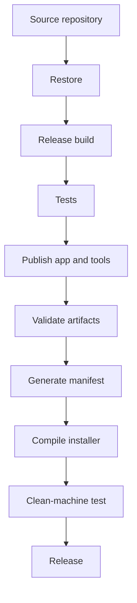

# Deployment Flow

```mermaid
flowchart TD
A[Source repository] --> B[Restore]
B --> C[Release build]
C --> D[Tests]
D --> E[Publish app and tools]
E --> F[Validate artifacts]
F --> G[Generate manifest]
G --> H[Compile installer]
H --> I[Clean-machine test]
I --> J[Release]
```
