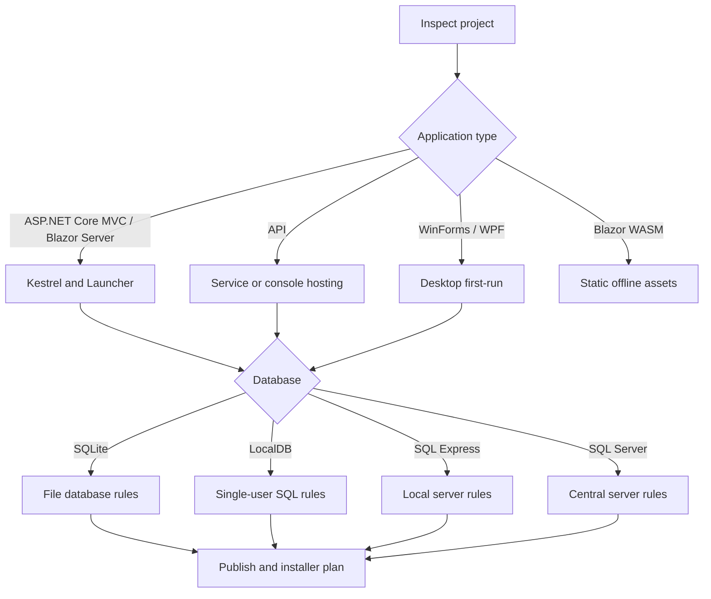

# Adaptive Decision Engine

## Decisions

- Self-contained or framework-dependent.
- Per-user or machine-wide.
- Portable or installed.
- Embedded or server database.
- HTTP or HTTPS.
- Online or offline updates.
- Interactive app or Windows Service.
